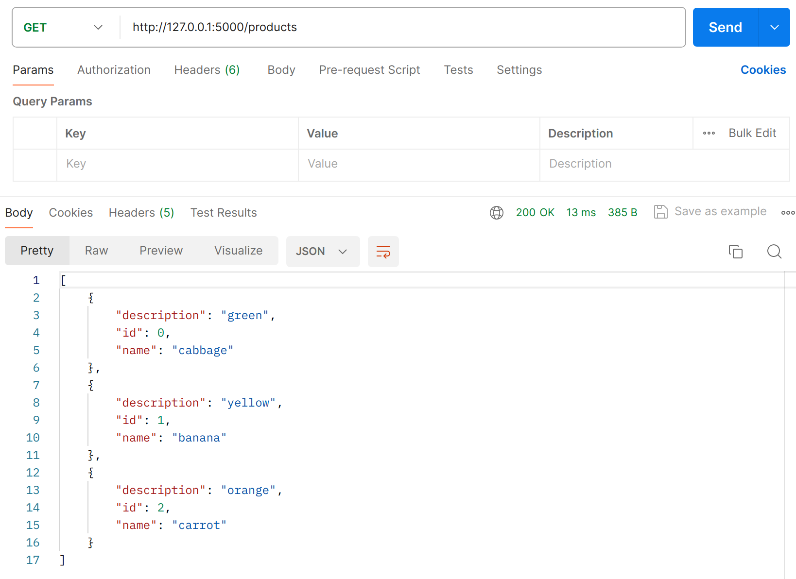
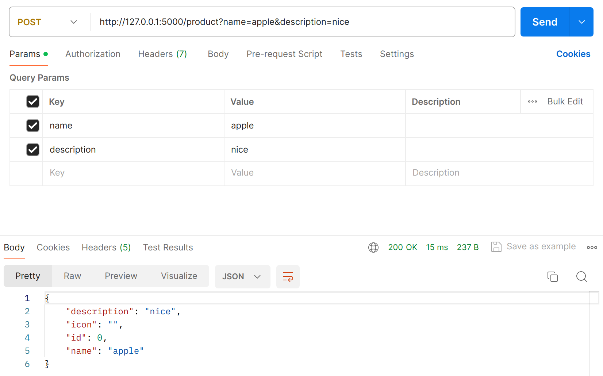

# Практика 2. Rest Service

## Программирование. Rest Service. Часть I

### Задание А (3 балла)
Создайте простой REST сервис, в котором используются HTTP операции GET, POST, PUT и DELETE.
Предположим, что это сервис для будущего интернет-магазина, который пока что умеет 
работать только со списком продуктов. У каждого продукта есть поля: `id` (уникальный идентификатор),
`name` и `description`. 

Таким образом, json-схема продукта (обозначим её `<product-json>`):

```json
{
  "id": 0,
  "name": "string",
  "description": "string"
}
```

Данные продукта от клиента к серверу должны слаться в теле запроса в виде json-а, **не** в параметрах запроса.

Ваш сервис должен поддерживать следующие операции:
1. Добавить новый продукт. При этом его `id` должен сгенерироваться автоматически
   - `POST /product`
   - Схема запроса:
     ```json
     {
       "name": "string",
       "description": "string"
     }
     ```
   - Схема ответа: `<product-json>` (созданный продукт)
2. Получить продукт по его id
   - `GET /product/{product_id}`
   - Схема ответа: `<product-json>`
3. Обновить существующий продукт (обновляются только те поля продукта, которые были переданы в теле запроса)
   - `PUT /product/{product_id}`
   - Схема запроса: `<product-json>` (некоторые поля могут быть опущены)
   - Схема ответа: `<product-json>` (обновлённый продукт)
4. Удалить продукт по его id
   - `DELETE /product/{product_id}`
   - Схема ответа: `<product-json>` (удалённый продукт)
5. Получить список всех продуктов 
   - `GET /products`  
   - Схема ответа:
     ```
     [ 
       <product-json-1>,
       <product-json-2>, 
       ... 
     ]
     ```

Предусмотрите возвращение ошибок (например, если запрашиваемого продукта не существует).

Вы можете положить код сервиса в отдельную директорию рядом с этим документом.

### Задание Б (3 балла)
Продемонстрируйте работоспособность сервиса с помощью программы Postman
(https://www.postman.com/downloads) и приложите соответствующие скрины, на которых указаны
запросы и ответы со стороны сервиса для **всех** его операций.

#### Демонстрация работы

Пример последовательного выполнения команд:

1. Запрос всех продуктов `GET /products`: 
2. Последовательное добавление нескольких продуктов `POST /product`:   
3. Запрос всех продуктов `GET /products`: 
4. Обновление нескольких продуктов `PUT /product/{product_id}`:  
5. Запрос всех продуктов `GET /products`: 
6. Последовательное удаление нескольких продуктов `DELETE /product/{product_id}`:  
7. Запрос всех продуктов `GET /products`: 

### Задание В (4 балла)
Пусть ваш продукт также имеет иконку (небольшую картинку). Формат иконки (картинки) может
быть любым на ваш выбор. Для простоты будем считать, что у каждого продукта картинка одна.

Добавьте две новые операции:
1. Загрузить иконку:
   - `POST product/{product_id}/image`
   - Запрос содержит бинарный файл — изображение  
     
2. Получить иконку:
   - `GET product/{product_id}/image`
   - В ответе передаётся только сама иконка  
     

Измените операции в Задании А так, чтобы теперь схема продукта содержала сведения о загруженной иконке, например, имя файла или путь:
```json
"icon": "string"
```

#### Демонстрация работы

Пример последовательного выполнения команд:

1. Последовательное добавление нескольких продуктов `POST /product`:  
2. Запрос всех продуктов `GET /products`: 
3. Добавление картинки к одному из продуктов `POST product/{product_id}/image`: 
4. Запрос всех продуктов `GET /products`: 
5. Запрос картинки `GET product/{product_id}/image`: 
6. Добавление картинки ко второму продукту `POST product/{product_id}/image`: 
7. Запрос картинки `GET product/{product_id}/image`: 
8. Запрос всех продуктов `GET /products`: 
9. Переименование иконки одного из продуктов `PUT /product/{product_id}`: 

---

_(*) В последующих домашних заданиях вам будет предложено расширить функционал данного сервиса._

## Задачи

### Задача 1 (2 балла)
Общая (сквозная) задержка прохождения для одного пакета от источника к приемнику по пути,
состоящему из $N$ соединений, имеющих каждый скорость $R$ (то есть между источником и
приемником $N - 1$ маршрутизатор), равна $d_{\text{сквозная}} = N \dfrac{L}{R}$
Обобщите данную формулу для случая пересылки количества пакетов, равного $P$.

#### Решение
Передача закончится, когда будет передан последний пакет. Он будет ожидать в очереди на отправку $d_{\text{ожидания}}=(P - 1)\dfrac{L}{R}$, а затем будет передаваться $d_{\text{сквозная}} = N \dfrac{L}{R}$. Итого:
$$d_{\text{общая сквозная}} = (N + P -1) \dfrac{L}{R}$$

### Задача 2 (2 балла)
Допустим, мы хотим отправить большой файл с хоста A на хост Б. Между хостами установлены три
последовательных канала соединения со следующими скоростями передачи данных:
$R_1 = 200$ Кбит/с, $R_2 = 3$ Мбит/с и $R_3 = 2$ Мбит/с.
Сколько времени приблизительно займет передача на хост Б файла размером $5$ мегабайт?

#### Решение
Так как скорость передачи по последовательным каналам данных берется из минимума всех скоростей передачи данных каналов, то:
$$\dfrac{5 \cdot 2^{20} \cdot 8}{200 \cdot 2^{10}} = 204.8~с $$

### Задача 3 (2 балла)
Предположим, что пользователи делят канал с пропускной способностью $2$ Мбит/с. Каждому
пользователю для передачи данных необходима скорость $100$ Кбит/с, но передает он данные
только в течение $20$ процентов времени использования канала. Предположим, что в сети всего $60$
пользователей. А также предполагается, что используется сеть с коммутацией пакетов. Найдите
вероятность одновременной передачи данных $12$ или более пользователями.

#### Решение
Пропускная способность канала может выдержать одновременно только 20 пользователей, поэтому:
$$\sum_{i=12}^{20} C_{60}^{i} \cdot 0.2^{i} \cdot 0.8^{60-i} = 0.5464$$

### Задача 4 (2 балла)
Пусть файл размером $X$ бит отправляется с хоста А на хост Б, между которыми три линии связи и
два коммутатора. Хост А разбивает файл на сегменты по $S$ бит каждый и добавляет к ним
заголовки размером $80$ бит, формируя тем самым пакеты длиной $L = 80 + S$ бит. Скорость
передачи данных по каждой линии составляет $R$ бит/с. Загрузка линий мала, и очередей пакетов
нет. При каком значении $S$ задержка передачи файла между хостами А и Б будет минимальной?
Задержкой распространения сигнала пренебречь.

#### Решение
Найдем общую задержку передачи файла. Всего пакетов $P = \lceil \dfrac{X}{S} \rceil$, $N=3$.

Тогда $d_{\text{общая сквозная}} = (3 + \lceil \dfrac{X}{S} \rceil - 1)\dfrac{80 + S}{R} = \dfrac{(2 + \dfrac{X}{S})(80 + S)}{R} = \dfrac{(2S + X)(80 + S)}{SR} = \dfrac{2S^2 + 160S + XS + 80X}{SR}$

Возьмем производную по $S$: $d'_{\text{общая сквозная}} = \dfrac{2}{R} - \dfrac{80X}{S^2}=0$
Тогда минимум будет достигаться в точке $S=\sqrt{40XR}$

### Задание 5 (2 балла)
Рассмотрим задержку ожидания в буфере маршрутизатора. Обозначим через $I$ интенсивность
трафика, то есть $I = \dfrac{L a}{R}$.
Предположим, что для $I < 1$ задержка ожидания вычисляется как $\dfrac{I \cdot L}{R (1 – I)}$. 
1. Напишите формулу для общей задержки, то есть суммы задержек ожидания и передачи.
2. Опишите зависимость величины общей задержки от значения $\dfrac{L}{R}$.

#### Решение

$$d_{\text{общая}} = d_{\text{ожидания}} + d_{\text{передачи}} = \dfrac{I \cdot L}{R (1 – I)} + \dfrac{L}{R} = \dfrac{L}{R}(\dfrac{I}{1-I}+1) = \dfrac{L}{R (1 – I)}$$

$$d_{\text{общая}} = \dfrac{L}{R (1 – I)} = \dfrac{L}{R (1 – \dfrac{L a}{R})} = |t= \dfrac{L}{R}|= \dfrac{t}{1-at}$$
