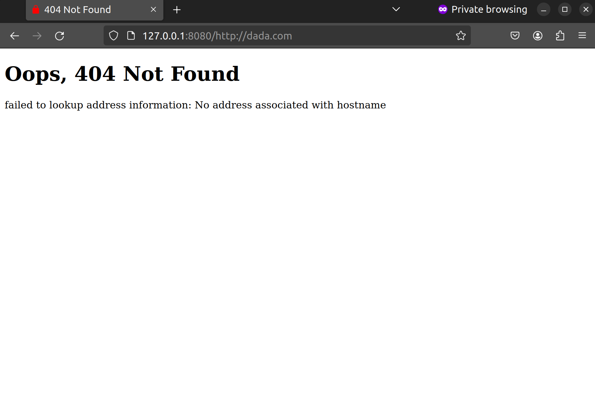
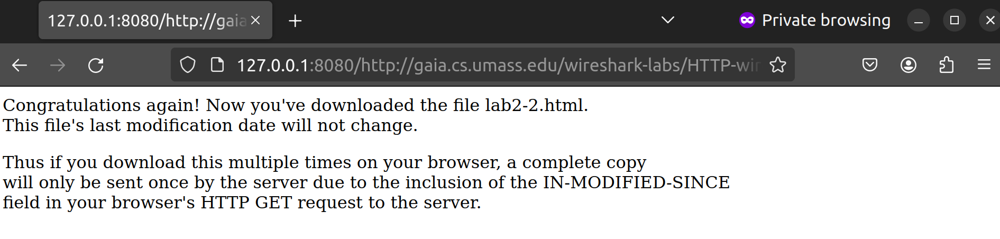
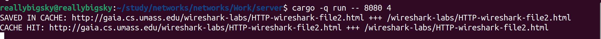
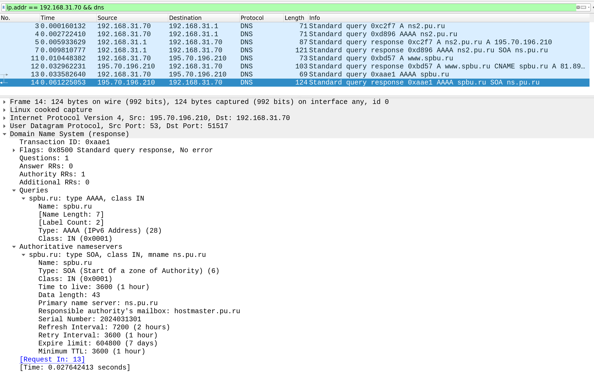

# Практика 4. Прикладной уровень

## Программирование сокетов: Прокси-сервер
Разработайте прокси-сервер для проксирования веб-страниц. 
Приложите скрины, демонстрирующие работу прокси-сервера. 

### Запуск прокси-сервера
Запустите свой прокси-сервер из командной строки, а затем запросите веб-страницу с помощью
вашего браузера. Направьте запросы на прокси-сервер, используя свой IP-адрес и номер порта.
Например, http://localhost:8888/www.google.com

_(*) Вы должны заменить стоящий здесь 8888 на номер порта в серверном коде, 
то есть тот, на котором прокси-сервер слушает запросы._

Вы можете также настроить непосредственно веб-браузер на использование вашего прокси сервера. 
В настройках браузера вам нужно будет указать адрес прокси-сервера и номер порта,
который вы использовали при запуске прокси-сервера (опционально).

### А. Прокси-сервер без кеширования (4 балла)
1. Разработайте свой прокси-сервер для проксирования http GET запросов от клиента веб-серверу 
   с журналированием проксируемых HTTP-запросов. В файле журнала сохраняется
   краткая информация о проксируемых запросах (URL и код ответа). Кеширование в этом
   задании не требуется. **(2 балла)**
2. Добавьте в ваш прокси-сервер обработку ошибок. Отсутствие обработчика ошибок может
   вызвать проблемы. Особенно, когда клиент запрашивает объект, который не доступен, так
   как ответ 404 Not Found, как правило, не имеет тела, а прокси-сервер предполагает, что
   тело есть и пытается прочитать его. **(1 балл)**
3. Простой прокси-сервер поддерживает только метод GET протокола HTTP. Добавьте
   поддержку метода POST. В запросах теперь будет использоваться также тело запроса
   (body). Для вызова POST запросов вы можете использовать Postman. **(1 балл)**

Приложите скрины или логи работы сервера.

#### Демонстрация работы

##### Get запросы

http://e-maxx.ru/


http://httpforever.com/


http://www.josephwcarrillo.com/


Логи:


##### Ошибки 




##### Post запрос


### Б. Прокси-сервер с кешированием (4 балла)
Когда прокси-сервер получает запрос, он проверяет, есть ли запрашиваемый объект в кэше, и,
если да, то возвращает объект из кэша без соединения с веб-сервером. Если объекта в кэше нет,
прокси-сервер извлекает его с веб-сервера обычным GET запросом, возвращает клиенту и
кэширует копию для будущих запросов.

Для проверки того, прокис объект в кеше или нет, необходимо использовать условный GET
запрос. В таком случае вам необходимо указывать в заголовке запроса значение для If-Modified-Since и If-None-Match. 
Подробности можно найти [тут](https://ruturajv.wordpress.com/2005/12/27/conditional-get-request).

Будем считать, что кеш-память прокси-сервера хранится на его жестком диске. Ваш прокси-сервер
должен уметь записывать ответы в кеш и извлекать данные из кеша (т.е. с диска) в случае
попадания в кэш при запросе. Для этого необходимо реализовать некоторую внутреннюю
структуру данных, чтобы отслеживать, какие объекты закешированы.

Приложите скрины или логи, из которых понятно, что ответ на повторный запрос был взят из кэша.

#### Демонстрация работы

Воспользуемся сайтом из первого домашнего задания: 
http://gaia.cs.umass.edu/wireshark-labs/HTTP-wireshark-file2.html

Первый запрос:


Вывод прокси в консоль: 


Wireshark:


Второй запрос: 



Вывод прокси в консоль:



Wireshark (Ответ сайта - 304 Not Modified):


### В. Черный список (2 балла)
Прокси-сервер отслеживает страницы и не пускает на те, которые попадают в черный список. Вместо
этого прокси-сервер отправляет предупреждение, что страница заблокирована. Список доменов
и/или URL-адресов для блокировки по черному списку задается в **конфигурационном файле**.

Приложите скрины или логи запроса из черного списка.

#### Демонстрация работы

Добавим в черный список `http://e-maxx.ru/algo/`:

Сначала зайдем в корень сайта, потом на сайт из черного списка, потом на его подсайт.


## Wireshark. Работа с DNS
Для каждого задания в этой секции приложите скрин с подтверждением ваших ответов.

### А. Утилита nslookup (1 балл)

#### Вопросы
1. Выполните nslookup, чтобы получить IP-адрес какого-либо веб-сервера в Азии
   - Сайт правительства Китая

   

2. Выполните nslookup, чтобы определить авторитетные DNS-серверы для какого-либо университета в Европе
   - Швейцарская техническая школа Цюриха
  
   

3. Используя nslookup, найдите веб-сервер, имеющий несколько IP-адресов. Сколько IP-адресов имеет веб-сервер вашего учебного заведения?
   - Несколько IP-адресов:
  
   

   - Сайт Университета ИТМО (один IP-адрес)
  
   

### Б. DNS-трассировка www.ietf.org (3 балла)

#### Подготовка
1. Используйте ipconfig для очистки кэша DNS на вашем компьютере.
2. Откройте браузер и очистите его кэш (для Chrome можете использовать сочетание клавиш
   CTRL+Shift+Del).
3. Запустите Wireshark и введите `ip.addr == ваш_IP_адрес` в строке фильтра, где значение
   ваш_IP_адрес вы можете получить, используя утилиту ipconfig. Данный фильтр позволит
   нам отбросить все пакеты, не относящиеся к вашему хосту. Запустите процесс захвата пакетов в Wireshark.
4. Зайдите на страницу www.ietf.org в браузере.
5. Остановите захват пакетов.


#### Вопросы
1. Найдите DNS-запрос и ответ на него. С использованием какого транспортного протокола
   они отправлены?
   - `UDP`
2. Какой порт назначения у запроса DNS?
   - `53`
3. На какой IP-адрес отправлен DNS-запрос? Используйте ipconfig для определения IP-адреса
   вашего локального DNS-сервера. Одинаковы ли эти два адреса?
   - `192.168.31.1`
   - У меня стоит Ubuntu, где такой утилиты нет (`ifconfig` такой информации не дает). Это адрес моего роутера, который является моим локальным DNS сервером


4. Проанализируйте сообщение-запрос DNS. Запись какого типа запрашивается? Содержатся
   ли в запросе какие-нибудь «ответы»?
   - Запись типа А
   - В запросе нет ответов
5. Проанализируйте ответное сообщение DNS. Сколько в нем «ответов»? Что содержится в
   каждом?


   - В сообщении 2 ответа 
   - Каждый содержит запись типа А на запрашиваемый сайт, каждая запись имеет свой IP-адрес

6. Посмотрите на последующий TCP-пакет с флагом SYN, отправленный вашим компьютером.
   Соответствует ли IP-адрес назначения пакета с SYN одному из адресов, приведенных в
   ответном сообщении DNS?


   - Да, запрос идет на адрес `104.16.45.99` из овтетного DNS сообщения
7. Веб-страница содержит изображения. Выполняет ли хост новые запросы DNS перед
   загрузкой этих изображений?
   - Нет, так как изображения находятся в поддомене самого сайта, поэтому их адрес уже известен.

### В. DNS-трассировка www.spbu.ru (2 балла)

#### Подготовка
1. Запустите захват пакетов с тем же фильтром `ip.addr == ваш_IP_адрес`
2. Выполните команду nslookup для сервера www.spbu.ru
3. Остановите захват
4. Вы увидите несколько пар запрос-ответ DNS. Найдите последнюю пару, все вопросы будут относиться к ней
   
Запрос:


Ответ:


#### Вопросы
1. Каков порт назначения в запросе DNS? Какой порт источника в DNS-ответе?
   - `53`
   - `53`
2. На какой IP-адрес отправлен DNS-запрос? Совпадает ли он с адресом локального DNS-сервера, установленного по умолчанию?
   - `192.168.31.1`
   - Это адрес моего WI-FI роутера, который является моим локальным DNS сервером.
3. Проанализируйте сообщение-запрос DNS. Запись какого типа запрашивается? Содержатся
   ли в запросе какие-нибудь «ответы»?
   - Запрашивается запись `AAAA` типа
   - Ответов в заросе нет
4. Проанализируйте ответное сообщение DNS. Сколько в нем «ответов»? Что содержится в каждом?
   - В ответном сообщении в этой паре самих ответов нет, но есть `Authoritative nameservers` с записью типа `SOA`
   - В предыдущей паре DNS сообщений есть ответы. Их там 2 с типами `CNAME` и `A`, а также поле `Additional records` с записью `A` типа
  
  

### Г. DNS-трассировка nslookup –type=NS (1 балл)
Повторите все шаги по предварительной подготовке из Задания B, но теперь для команды `nslookup –type=NS spbu.ru`

Запрос: 


Ответ:


#### Вопросы
1. На какой IP-адрес отправлен DNS-запрос? Совпадает ли он с адресом локального DNS-сервера, установленного по умолчанию?
   - `192.168.31.1`
   - Совпадает
2. Проанализируйте сообщение-запрос DNS. Запись какого типа запрашивается? Содержатся ли в запросе какие-нибудь «ответы»?
   - Запрашивается запись типа `NS`
   - Запрос не содержит ответов
3. Проанализируйте ответное сообщение DNS. Имена каких DNS-серверов университета в
   нем содержатся? А есть ли их адреса в этом ответе?
   - `ns.pu.ru`, `ns7.spbu.ru`, `ns2.pu.ru`
   - Адресов этих серверов в ответе нет

### Д. DNS-трассировка nslookup www.spbu.ru ns2.pu.ru (1 балл)
Снова повторите все шаги по предварительной подготовке из Задания B, но теперь для команды `nslookup www.spbu.ru ns2.pu.ru`.
Запись `nslookup host_name dns_server` означает, что запрос на разрешение доменного имени `host_name` пойдёт к `dns_server`.
Если параметр `dns_server` не задан, то запрос идёт к DNS-серверу по умолчанию (например, к локальному).

Запрос:


Ответ:



#### Вопросы
1. На какой IP-адрес отправлен DNS-запрос? Совпадает ли он с адресом локального DNS-сервера, установленного по умолчанию? 
   Если нет, то какому хосту он принадлежит?
   - `195.70.196.210`
   - Это адрес, указанный в одном ответов на предыдущий DNS запрос
2. Проанализируйте сообщение-запрос DNS. Запись какого типа запрашивается? Содержатся
   ли в запросе какие-нибудь «ответы»?
   - Запрашивается запись типа `AAAA`
   - Ответов в запросе нет
3. Проанализируйте ответное сообщение DNS. Сколько в нем «ответов»? Что содержится в
   каждом?
   - Ответов нет, есть `Authoritative nameservers` с одной записью типа `SOA` и временными параметрами для кеширования.
   - Ответы есть в предыдущих сообщениях с сервера.


### Е. Сервисы whois (2 балла)
1. Что такое база данных whois?
   - Регистрационные данные о владельцах доменых имен, IP-адресов и автономных систем.
2. Используя различные сервисы whois в Интернете, получите имена любых двух DNS-серверов. 
   Какие сервисы вы при этом использовали?

 vk.com


```
Информация по данным whois.nic.ru
Domain Name: VK.COM
Registry Domain ID: 3206186_DOMAIN_COM-VRSN
Registrar WHOIS Server: whois.nic.ru
Registrar URL: http://www.nic.ru
Updated Date: 2024-01-30T17:11:22Z
Creation Date: 1997-06-24T04:00:00Z
Registrar Registration Expiration Date: 2024-06-22T21:00:00Z
Registrar: Regional Network Information Center, JSC dba RU-CENTER
Registrar IANA ID: 463
Registrar Abuse Contact Email: tld-abuse@nic.ru
Registrar Abuse Contact Phone: +7.4959944601
Domain Status: clientTransferProhibited https://icann.org/epp#clientTransferProhibited
Registry Registrant ID:
Registrant Name: Privacy protection service - whoisproxy.ru
Registrant Organization: Privacy protection service - whoisproxy.ru
Registrant Street: PO box 99, whoisproxy.ru
Registrant City: Moscow
Registrant State/Province: Moscow
Registrant Postal Code: 123308
Registrant Country: RU
Registrant Phone: +7.4957856536
Registrant Phone Ext:
Registrant Email: vk.com@whoisproxy.ru
Registry Admin ID:
Admin Name: Privacy protection service - whoisproxy.ru
Admin Organization: Privacy protection service - whoisproxy.ru
Admin Street: PO box 99, whoisproxy.ru
Admin City: Moscow
Admin State/Province: Moscow
Admin Postal Code: 123308
Admin Country: RU
Admin Phone: +7.4957856536
Admin Phone Ext:
Admin Email: vk.com@whoisproxy.ru
Registry Tech ID:
Tech Name: Privacy protection service - whoisproxy.ru
Tech Organization: Privacy protection service - whoisproxy.ru
Tech Street: PO box 99, whoisproxy.ru
Tech City: Moscow
Tech State/Province: Moscow
Tech Postal Code: 123308
Tech Country: RU
Tech Phone: +7.4957856536
Tech Phone Ext:
Tech Email: vk.com@whoisproxy.ru
Name Server: ns1.vk.com 87.240.131.131
Name Server: ns2.vk.com 95.213.21.21
Name Server: ns3.vk.com 93.186.238.238
Name Server: ns4.vk.com 87.240.136.136
DNSSEC: unsigned
URL of the ICANN WHOIS Data Problem Reporting System: http://wdprs.internic.net/
For more information on Whois status codes, please visit: https://icann.org/epp
>>> Last update of WHOIS database: 2024.03.17T22:09:37Z <<<
```

```
Информация по данным whois.verisign-grs.com
Domain Name: VK.COM
Registry Domain ID: 3206186_DOMAIN_COM-VRSN
Registrar WHOIS Server: whois.nic.ru
Registrar URL: http://nic.ru
Updated Date: 2024-01-30T17:11:23Z
Creation Date: 1997-06-24T04:00:00Z
Registry Expiry Date: 2024-06-23T04:00:00Z
Registrar: Regional Network Information Center, JSC dba RU-CENTER
Registrar IANA ID: 463
Registrar Abuse Contact Email: tld-abuse@nic.ru
Registrar Abuse Contact Phone: +74950091333
Domain Status: clientTransferProhibited https://icann.org/epp#clientTransferProhibited
Name Server: NS1.VK.COM
Name Server: NS2.VK.COM
Name Server: NS3.VK.COM
Name Server: NS4.VK.COM
DNSSEC: unsigned
URL of the ICANN Whois Inaccuracy Complaint Form: https://www.icann.org/wicf/
>>> Last update of whois database: 2024-03-17T19:09:33Z <<<
```

3. Используйте команду nslookup на локальном хосте, чтобы послать запросы трем конкретным
   серверам DNS (по аналогии с Заданием Д): вашему локальному серверу DNS и двум DNS-серверам, найденным в предыдущей части.
   
   

   

   