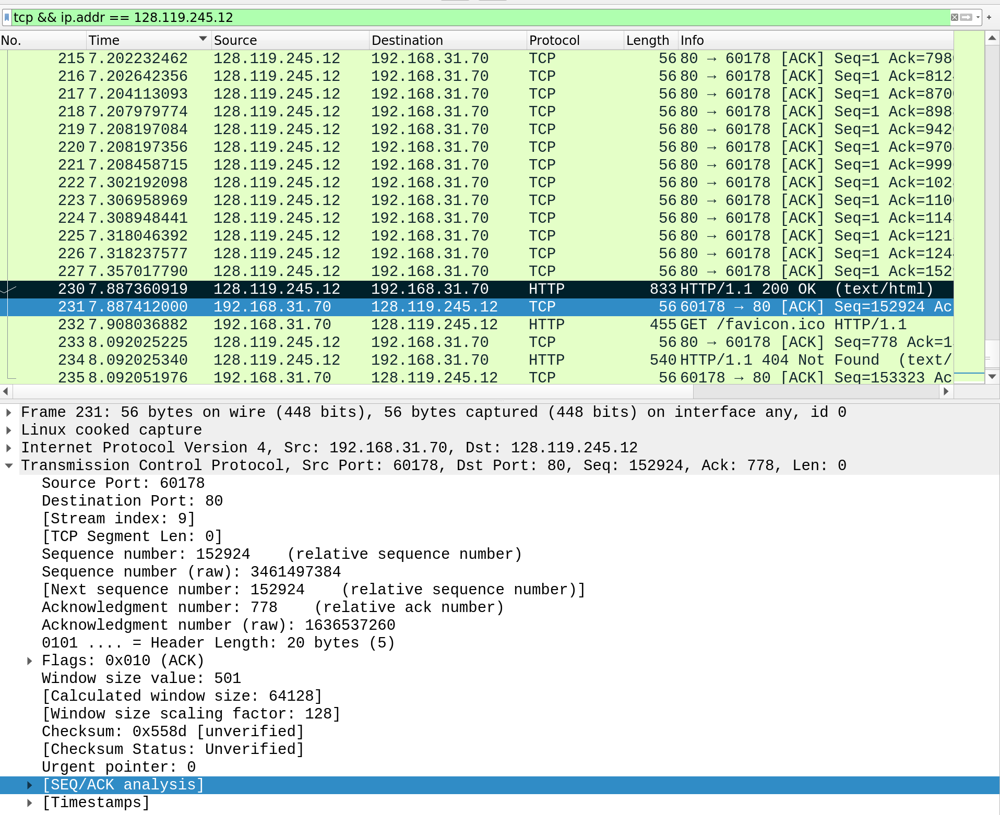

# Практика 7. Транспортный уровень

## Wireshark: TCP (5 баллов)

### Перехват TCP-передачи данных от вашего компьютера удаленному серверу
При ответе на вопросы прикладывайте соответствующие скрины программы Wireshark.

#### Подготовка
1. Откройте веб-браузер и перейдите по ссылке gaia.cs.umass.edu/wireshark-labs/alice.txt.
   Здесь вы найдете копию книги «Алиса в стране чудес» в формате ASCII. Сохраните этот файл 
   на свой компьютер.
2. Перейдите по ссылке: gaia.cs.umass.edu/wireshark-labs/TCP-wireshark-file1.html. Сюда вы
   будете загружать ранее сохраненный файл.
3. Запустите Wireshark и начните перехват пакетов.
4. Теперь загрузите текстовый файл «Алиса в стране чудес» на указанной в п.2 страничке.
5. Остановите захват пакетов в приложении Wireshark. Используйте фильтр пакетов tcp.

#### Вопросы
1. Какой IP-адрес и номер порта TCP использует ваш компьютер (отправитель), передающий
   файл серверу gaia.cs.umass.edu? Для ответа на вопрос, возможно, проще выбрать http-сообщение
   и рассмотреть информацию TCP-пакета, используемого для передачи этого http-сообщения, 
   в окне деталей заголовка пакета.
   - Запрос: 
   - `IP: 192.168.31.70`
   - `port: 60178`
2. Каков IP-адрес у сервера gaia.cs.umass.edu? Каковы номера портов для отправки и приема
   TCP-сегментов этого соединения?
   - 
   - `IP: 128.119.245.12`
   - Порт для отправки совпадает с портом для приема сегментов и равен дефолтному порту для HTTP соединений: `80`
3. Какой порядковый номер у SYN TCP-сегмента, который используется для установления
   TCP-соединения между компьютером клиента и сервером gaia.cs.umass.edu? Как
   определяется, что это именно SYN-сегмент?
   - SYN сегмент: 
   - `Sequence number: 0`
   - `Flags: 0x002 (SYN)`
4. Какой порядковый номер у SYNACK-сегмента, отправленного сервером gaia.cs.umass.edu
   на компьютер клиента в ответ на SYN-сегмент? Какое значение хранится в поле
   подтверждения в SYNACK-сегменте? Как сервер gaia.cs.umass.edu определил это значение?
   Как определяется, что это именно SYNACK-сегмент?
   - SYNACK сегмент: 
   - `Sequence number: 0`
   - `Acknowledgement number: 1`
   - Сервер определил это по пришедшему SYN сегменту
   - Понять, что это SYNACK сегмент можно по полю `Flags: 0x012 (SYN, ACK)`
5. Какой порядковый номер у TCP-сегмента, содержащего команду POST протокола HTTP?
   (для нахождения команды POST вам потребуется проникнуть внутрь поля содержимого
   пакета в нижней части окна Wireshark, чтобы найти сегмент, в поле DATA которого
   хранится значение POST)
   - 
   - `Sequence number: 151803`
6. Рассмотрите TCP-сегмент, содержащий команду POST протокола HTTP, как первый TCP-сегмент соединения. Какие порядковые номера у первых шести сегментов TCP-соединения 
   (включая сегмент, содержащий команду POST протокола HTTP)? Когда был
   отправлен каждый сегмент? Когда был получен ACK-пакет для каждого сегмента?
   Покажите разницу между тем, когда каждый TCP-сегмент был отправлен и когда было
   получено каждое подтверждение, чему равно значение RTT для каждого из 6 сегментов?
   - Всего, считая POST запрос как первый TCP сегмент, было отправлено 4 сегмента (И только 2 из них с моего компьютера). Пакеты с книгой в виде данных отправляются до HTTP POST запроса. RTT имеет смысл считать только для исходящих сегментов.
   - Первый сегмент:
   `Sequence number: 151803`
   `Time: 7.201101119`

   
   
   Его ACK:
   `Time: 7.357017790`
   

   RTT = `7.357017790 - 7.201101119 = 0.155916671`

   - Второй сегмент:
   `Sequence number: 1`
   `Time: 7.887360919`

   

   Его ACK:
   `Time: 7.887412000`
   

   RTT не узнать, так как сегмент входящий.

   - Третий сегмент:
   `Sequence number: 152924`
   `Time: 7.908036882`

   

   Его ACK:
   `Time: 8.092025225`
   

   RTT = `8.092025225 - 7.908036882 = 0.183988343`

   - Четвертый сегмент:
   `Sequence number: 778`
   `Time: 8.092025340`

   

   Его ACK:
   `Time: 8.092051976`

   

   RTT не узнать, так как сегмент входящий.

7. Чему равна пропускная способность (количество байтов, передаваемых в единицу
   времени) для этого TCP-соединения? Объясните, как вы получили это значение.
   - Поделим сумму длин исходящий сегментов и их ACK на сумму соответствующих RTT.
   - $\dfrac{1177+56+455+56}{0.155916671 + 0.183988343} = 5130.84517194~байт/с$

### Работа с Time-Sequence-Graph (Stevens) (2 балла)
Time-Sequence-Graph (Stevens) (Временная шкала (Стивенса)) – одна из графических утилит
Wireshark для протокола TCP. Для того, чтобы ее запустить, выберите TCP-сегмент в окне
захваченных полученных пакетов. Затем выберите команду меню Statistics => TCP Stream Graph =>
Time-Sequence-Graph (Stevens) (Статистика => График TCP потока => Временная шкала (Стивенса)).
Каждая точка представляет отправленный TCP-сегмент, на графике изображена зависимость
порядкового номера сегмента от времени, когда он был отправлен.

#### Подготовка (такая же, как в предыдущем задании)
1. Откройте веб-браузер и перейдите по ссылке gaia.cs.umass.edu/wireshark-labs/alice.txt.
   Здесь вы найдете копию книги «Алиса в стране чудес» в формате ASCII. Сохраните этот файл на
   свой компьютер.
2. Перейдите по ссылке: gaia.cs.umass.edu/wireshark-labs/TCP-wireshark-file1.html. Сюда вы
   будете загружать ранее сохраненный файл.
3. Запустите Wireshark и начните перехват пакетов
4. Теперь загрузите текстовый файл «Алиса в стране чудес» на указанной в п.2 страничке
5. Остановите захват пакетов в приложении Wireshark. Используйте фильтр пакетов tcp.

#### Задание
Используйте инструмент построения графиков Time-Sequence-Graph (Stevens), чтобы представить
изменение порядковых номеров на временной шкале для сегментов, отправленных от клиента
серверу gaia.cs.umass.edu. Приложите соответствующий скрин программы Wireshark.

#### Скрин

По графику и временным меткам из скринов первого задания видно, что POST запрос отправляется в самом конце после полной отправки книги.


## Программирование. Эхо-запросы через UDP
Реализуйте сервер для пингования, а также его клиента.

### А. Серверная часть (2 балла)
Сервер находится в бесконечном цикле, ожидая приходящие UDP-пакеты.
Если пакет прибывает, то сервер просто изменяет символы входящего сообщения на заглавные и
отправляет их обратно клиенту. Серверный код должен моделировать 20% потерю пакетов.

### Б. Клиентская часть (2 балла)
Клиент должен отправить 10 эхо-запросов серверу. Поскольку UDP является ненадежным с точки
зрения доставки протоколом, то пакет, отправленный от клиента к серверу или наоборот, может
быть потерян в сети. Так как клиент не может бесконечно ждать ответа на запрос, нужно задать
период ожидания ответа (тайм-аут), равный одной секунде – если ответ не будет получен в
течение одной секунды, клиентская программа должна предполагать, что пакет потерян.

Ваша клиентская программа должна:
- отправить эхо-запрос, используя UDP
- распечатать ответное сообщение от сервера (если такое есть)
- вычислить и вывести на печать время оборота (RTT) в секундах для каждого пакета при
ответе сервера
- в противном случае, вывести сообщение «Request timed out»

Формат сообщения:
`Ping номер_последовательности время`
- номер_последовательности начинается с 1 и увеличивается до 10 для каждого
последующего сообщения, отправленного клиентом
- время – это момент времени, когда клиент отправляет сообщение

Сделайте скриншоты, подтверждающие корректную работу вашей программы пингования со стороны клиента.

#### Демонстрация работы

Запущен сервер и 2 клиента. Сервер слева, клиенты по центру и справа.


### В. Вывод в формате ping (2 балла)
Версия клиента из предыдущей части (Б) вычисляет время оборота для каждого пакета и выводит
его отдельно. Измените вывод таким образом, чтобы он соответствовал тому, как это делается в
стандартной утилите ping.

Для этого вам нужно будет сообщить минимальное, максимальное и среднее значение RTT в
конце каждого ответа от сервера. Дополнительно вычислите коэффициент потери пакетов (в
процентах).

#### Демонстрация работы


### Г. UDP Heartbeat (4 балла)
UDP Heartbeat (монитор доступности) подобен программе пингования. Он может быть
использован для проверки, работает ли приложение, и вывода сообщения об односторонней
потере пакетов.

Клиент отправляет порядковый номер и текущую временную метку в пакете UDP на сервер,
который слушает «сердцебиение» (т.е. ожидает UDP-пакеты) клиента. После получения пакетов
сервер вычисляет разницу во времени и сообщает о потерях. Если пакеты отсутствуют
определенный период времени, заданный параметром, то делается предположение, что
клиентское приложение остановлено и соответствующее сообщение выводится на консоль
сервера.

Реализуйте UDP Heartbeat (обе части – клиент и сервер), доработав обе ваши части программы
пингования из заданий А и Б.

Обратите внимание, что клиентов у сервера может быть сразу несколько одновременно.
Протестируйте такой сценарий.

#### Демонстрация работы

Запущен сервер и 3 клиента. Консоли клиентов сверху, вывод сервера под ними.

```
HEARTBEAT_PERIOD - задержка между сообщениями с клиентов в секундах
```

Первый клиент: `HEARTBEAT_PERIOD=1`
Второй клиент: `HEARTBEAT_PERIOD=3`
Третий клиент: `HEARTBEAT_PERIOD=5`

Все клиенты с вероятностью `20%` пропускают отправку текущего пакета (эмуляция потерь)


## Задачи

### Задача 1 (3 балла)
Рассмотрим протоколы GBN и SR. Предположим, пространство порядковых номеров имеет размер $k$.

Постановка задачи: найти наибольшее допустимое окно передачи, которое позволит обойти
возникновение проблемы, показанной на рисунке для каждого из этих протоколов?


Описание проблемы:
Отсутствие синхронизации между окнами отправителя и получателя имеет важные последствия,
когда мы сталкиваемся с ограниченностью диапазона порядковых номеров. Рассмотрим, что
могло бы произойти, например, если у нас есть четыре пакета с порядковыми номерами 0, 1, 2, 3,
а размер окна равен трем. Предположим, пакеты с 0 по 2 переданы отправителем, корректно
получены и подтверждены получателем. В этот момент окно получателя заполняется четвертым,
пятым и шестым пакетами, которые имеют порядковые номера 3, 0 и 1, соответственно. Теперь
рассмотрим два сценария.

В первом сценарии (на рисунке сверху) квитанции ACK на первые три пакета доставлены верно.
Таким образом, отправитель сдвигает окно вперед и отправляет четвертый, пятый и шестой
пакеты с порядковыми номерами 3, 0 и 1 соответственно.
Пакет с порядковым номером 3 потерян, но пакет с порядковым номером 0, **содержащий новые данные**, 
получен.

Во втором случае (рисунок снизу) ACK пакеты для первых трех пакетов данных потеряны, и
отправитель пересылает эти пакеты. Таким образом, получатель далее получает пакет с
порядковым номером 0 — **копию первого отправленного**.
Теперь рассмотрим ту же ситуацию с точки зрения принимающей стороны. Действия,
выполняемые передающей стороной, скрыты от нее; принимающая сторона способна лишь
следить за последовательностями получаемых пакетов и генерируемых квитанций. Подобная
ограниченность приводит к тому, что обе описанные выше ситуации воспринимаются
принимающей стороной как одинаковые. Она не может отличить исходную передачу пакета от
повторной.

#### Решение

Чтобы данная проблема не происходила, необходимо исключить возможность пересечения номеров пакетов из двух окон. Тогда, если пространство порядковых номеров пакетов имеет размер $k$, то размер окна не должен превышать $\lfloor \dfrac{k}{2} \rfloor$, так как в таком случае, если будут потери пакетов и подтверждений, то из-за отсутствия пересений можно однозначно понять какой именно пакет потерян. То есть мы не начнем пересылать пакет с номером $\lfloor \dfrac{k}{2} \rfloor$, пока не доставим пакет с нулевым номером и т.д. Отсюда, не может быть такого, что получаетль и отправитель будут видеть под одним и тем же номером разные пакеты.

### Задача 2 (2 балла)
Представим себе следующую ситуацию: один хост расположен в Санкт-Петербурге, а другой — во
Владивостоке. Пусть время оборота RTT между этими двумя хостами приблизительно равно $30$ мс.
Предположим далее, что хосты соединены каналом со скоростью передачи $R$, равной $1$ Гбит/с
($10^9$ бит/с).

Предположим, что размер передаваемого пакета составляет $1500$ байт, включая поля
заголовка и данные.

Насколько большим должен быть размер окна $n$, чтобы использование канала составило
более $98$ процентов?

#### Решение

$$U = n \cdot \dfrac{\dfrac{L}{R}}{RTT + \dfrac{L}{R}} \gt 98 $$

$$n \gt 98 \cdot \dfrac{RTT + \dfrac{L}{R}}{\dfrac{L}{R}} = 2450$$